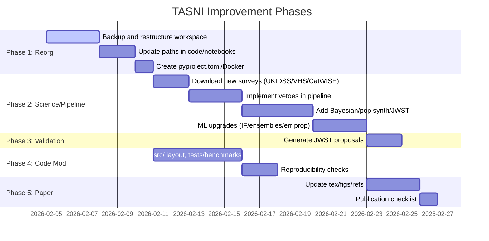

# Comprehensive Improvement Plan for TASNI

## Executive Summary

This plan synthesizes insights from [`docs/PROJECT_ANALYSIS.md`](docs/PROJECT_ANALYSIS.md), scientific review gaps (UKIDSS/VHS/CatWISE vetoes, Bayesian modeling, population synthesis, JWST validation), and [`docs/WORKSPACE_ORGANIZATION_PLAN.md`](docs/WORKSPACE_ORGANIZATION_PLAN.md). TASNI excels in ML-optimized pipeline yielding 4 extreme fading thermal orphan candidates and golden 100 targets, but requires enhancements in organization, science, pipeline, code, data, and paper for publication and extension.

**Priorities**:
1. Workspace reorganization (implement proposed structure).
2. Scientific enhancements (new vetoes, ML upgrades, Bayesian/pop/JWST).
3. Validation (JWST proposals).
4. Code modernization (src/, pyproject.toml, tests).
5. Paper polish (updates, checklist).

Phased approach ensures minimal disruption, with dependencies and metrics for success.

## Detailed Improvements by Category

### Organization
Implement Cookiecutter Data Science structure per [`docs/WORKSPACE_ORGANIZATION_PLAN.md`](docs/WORKSPACE_ORGANIZATION_PLAN.md):
- Create `src/tasni/` package (pipeline.py, ml/, utils/).
- Restructure data: `raw/` (WISE/Gaia/NVSS), `external/` (sonora_cholla), `interim/` (data/interim/checkpoints/crossmatches), `processed/` (tier5_features, golden_*).
- Move outputs: `reports/figures/` (all figs), `notebooks/`, `tests/` (benchmarks → tests/benchmarks).
- Add `pyproject.toml` (Poetry from requirements.txt), enhance Dockerfile/Makefie/.env.
- Clean legacy/docs/output cruft.

**Estimated Effort**: Medium (file moves, path updates).
**Success Metrics**: All paths resolve, pipeline resumes from checkpoints.

### Science
Address gaps:
- **New Vetoes**: Tier4+ veto UKIDSS, VHS (near-IR), CatWISE (WISE motion/reliable sources).
- **Bayesian Modeling**: Teff/posterior distances via Sonora Cholla + parallax priors.
- **Population Synthesis**: Mock catalogs (Y-dwarfs, planets) vs. golden sample.
- **JWST Validation**: Update [`docs/JWST_PROPOSAL_GUIDE.md`](docs/JWST_PROPOSAL_GUIDE.md) with top candidates, NIRSpec/MIRI specs.

**Estimated Effort**: High (new data/ML).
**Success Metrics**: Reduced contaminants (e.g., 20% tier5 drop), model p-values <0.05.

### Pipeline
Enhance tiers:
- **New Surveys**: Integrate UKIDSS/VHS/CatWISE vetoes post-Tier4.
- **ML Upgrades**: Add Isolation Forest (anomaly detection), ensembles (RF/XGB/NN + IF), error propagation (bootstrap uncertainties).
- **Variability**: Trend fits with uncertainties.
- GPU/crossmatch optimizations, async downloads.

**Estimated Effort**: Medium-High.
**Success Metrics**: Pipeline runtime < current, golden score ROC-AUC >0.95.

### Code
- Adopt `src/tasni/` layout, lowercase_underscores.
- `pyproject.toml`: Poetry/PDM for deps/reproducibility.
- Add `tests/` (pytest for tiers/ML), `benchmarks/`.
- Pre-commit, linting (black/isort/ruff).
- Config via .env/dataclasses.

**Estimated Effort**: Medium.
**Success Metrics**: `pytest --cov >80%`, `poetry install` reproduces env.

### Data
- Standardize: raw (immutable downloads), interim (checkpoints), processed (features/golden), external (models).
- New Downloads: UKIDSS/VHS/CatWISE catalogs.
- Versioning: DVC for large data, git-lfs for models.

**Estimated Effort**: Low-Medium.
**Success Metrics**: Data lineage traceable, new vetoes applied.

### Paper
- Update [`docs/paper/tasni_paper.tex`](docs/paper/tasni_paper.tex): New methods (vetoes/Bayesian/ML), results (updated golden/JWST), figs (synth comps).
- Refresh figs in `reports/figures/` with enhancements.
- Add refs (new surveys/models), publication checklist [`docs/PUBLICATION_CHECKLIST.md`](docs/PUBLICATION_CHECKLIST.md).

**Estimated Effort**: Low.
**Success Metrics**: LaTeX compiles, checklist 100% green.

## Phased Roadmap

Dependencies: Phase1 → all; Phase2 → Phase3/5; Phase4 parallel post-Phase1.

## Risks/Mitigations
- **Data Moves Break Paths**: Pre/post rsync tests, regex path search/replace.
- **New Vetoes Overfilter**: Tune radii, validate on known Y-dwarfs.
- **ML Overfit**: Cross-val, holdout golden.
- **Repro Failure**: Docker tests, pinned deps.
- **Paper Timeline**: Modular sections.

## Next Actions
- Review/approve this plan.
- Switch to code/orchestrator mode for Phase1 execution.
- Backup workspace.
