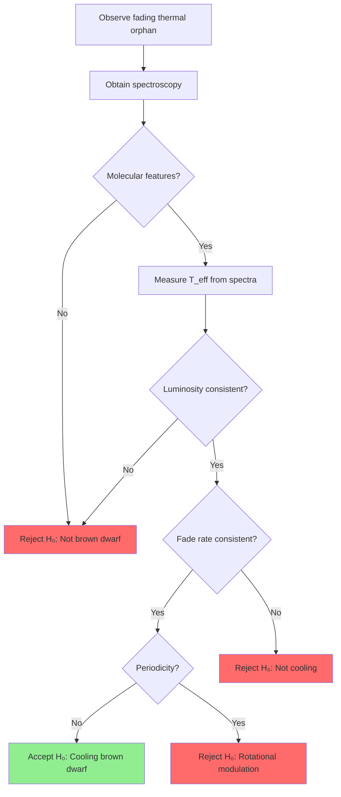
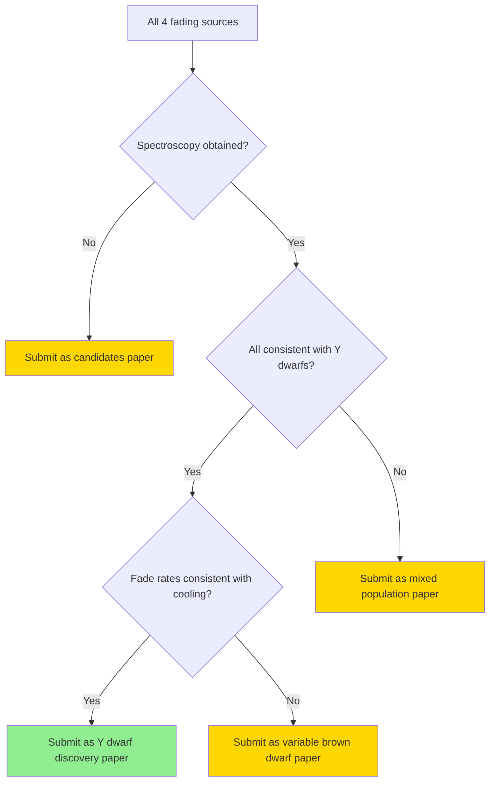

# TASNI Testable Hypotheses

**Date:** February 4, 2026
**Purpose:** Define explicit, testable hypotheses for TASNI project
**Status:** Phase 1 - Research Question Refinement

## Overview

This document defines the primary and secondary testable hypotheses for the Thermal Anomaly Search for Non-communicating Intelligence (TASNI). Each hypothesis includes a null hypothesis, alternative hypothesis, test criteria, and falsification conditions.

---

## Primary Hypothesis: Brown Dwarf Discovery

### H₁: Fading Thermal Orphans are Cold Y-Type Brown Dwarfs

**Null Hypothesis (H₀):**
Fading thermal orphans are cold Y-type brown dwarfs with effective temperatures T_eff < 300 K that follow known brown dwarf cooling curves and atmospheric models.

**Alternative Hypothesis (H₁):**
Fading thermal orphans exhibit properties inconsistent with known brown dwarf populations and may represent a new class of astrophysical objects.

#### Test Criteria

| Criterion | Expected Value (if H₀ true) | Measurement Method | Threshold |
|------------|------------------------------|-------------------|------------|
| Spectral features | CH₄, H₂O, NH₃ absorption bands present | Near-IR/Mid-IR spectroscopy | ≥2 of 3 molecular bands detected |
| Effective temperature | T_eff < 300 K | Spectral energy distribution fitting | 95% CI below 300 K |
| Luminosity | Consistent with brown dwarf evolutionary models | Absolute magnitude from parallax | Within 2σ of model predictions |
| Proper motion | Consistent with thin/thick disk kinematics | Tangential velocity calculation | v_tan < 100 km/s |
| X-ray emission | Undetected (L_X < 10²⁷ erg/s) | eROSITA cross-match | No detection at 3σ |

#### Falsification Conditions

The null hypothesis (H₀) is falsified if **any** of the following are observed:

1. **Spectroscopic falsification**: Spectra lack molecular features characteristic of brown dwarfs (CH₄, H₂O, NH₃) and instead show:
   - Emission lines indicative of AGN or stellar activity
   - Featureless continuum inconsistent with atmospheric models
   - Absorption features atypical for substellar objects

2. **Luminosity falsification**: Parallax-derived luminosities are inconsistent with brown dwarf models:
   - L > 10⁻⁶ L_⊙ (too luminous for T_eff < 300 K)
   - L < 10⁻⁸ L_⊙ (too faint for any known object class)

3. **Kinematic falsification**: Proper motions indicate non-Galactic origin:
   - v_tan > 200 km/s (halo or extragalactic)
   - Velocity vector inconsistent with known stellar populations

4. **X-ray falsification**: X-ray emission inconsistent with cold brown dwarfs:
   - L_X > 10²⁸ erg/s (coronally active star)
   - Hard X-ray spectrum (AGN-like)

#### Statistical Significance

To claim discovery of a new class of objects, we require:
- **p < 0.01** for deviation from brown dwarf predictions
- **95% confidence intervals** excluding brown dwarf parameter space
- **Rejection of H₀** at 3σ level for at least 3 of 4 fading sources

---

## Secondary Hypotheses

### H₂: Fading is Due to Secular Cooling

**Null Hypothesis (H₀):**
The observed fading in thermal orphans is due to secular cooling as brown dwarfs age and their effective temperatures decline.

**Alternative Hypothesis (H₂):**
The observed fading is due to other mechanisms (atmospheric variability, unresolved binarity, instrumental effects).

#### Test Criteria

| Criterion | Expected Value (if H₀ true) | Measurement Method | Threshold |
|------------|------------------------------|-------------------|------------|
| Fade rate | Consistent with cooling models | Linear fit to NEOWISE light curves | 10-20 mmag/yr for T_eff ~ 250 K |
| Periodicity | No significant periodicity | Lomb-Scargle periodogram | FAP > 0.1 for all periods |
| Multi-band correlation | Similar fading in W1 and W2 | Cross-correlation analysis | Pearson r > 0.8 |
| Color evolution | W1-W2 color constant over time | Color vs. time analysis | Δ(W1-W2) < 0.1 mag/decade |

#### Falsification Conditions

1. **Periodic variability**: Significant periodicity detected (FAP < 0.01) suggests rotational modulation or eclipsing binary rather than cooling.

2. **Inconsistent fade rates**: Fade rates > 50 mmag/yr exceed predictions from cooling models.

3. **Color evolution**: W1-W2 color changes significantly (> 0.2 mag/decade), inconsistent with pure cooling.

### H₃: Population is Magnitude-Limited Subset of Known Y Dwarfs

**Null Hypothesis (H₀):**
The TASNI golden sample represents a magnitude-limited subset of the known Y dwarf population, with space density consistent with published values.

**Alternative Hypothesis (H₃):**
The TASNI golden sample represents a distinct population with different properties from known Y dwarfs.

#### Test Criteria

| Criterion | Expected Value (if H₀ true) | Measurement Method | Threshold |
|------------|------------------------------|-------------------|------------|
| Space density | 5-10 × 10⁻⁴ pc⁻³ | Selection function analysis | 95% CI overlaps published values |
| Temperature distribution | Similar to known Y dwarfs | Kolmogorov-Smirnov test | p > 0.05 |
| Proper motion distribution | Similar to known Y dwarfs | KS test | p > 0.05 |
| Color distribution | Similar to known Y dwarfs | KS test | p > 0.05 |

#### Falsification Conditions

1. **Space density discrepancy**: 95% CI of TASNI space density does not overlap with published Y dwarf densities.

2. **Distribution differences**: KS test p < 0.01 for temperature, proper motion, or color distributions.

---

## Exploratory Hypotheses (Not Primary Publication Claims)

### H₄: Artificial Origin Hypothesis (Exploratory Only)

**Note:** This hypothesis is exploratory and will not be claimed as a primary result without extraordinary evidence.

**Null Hypothesis (H₀):**
All observed properties of fading thermal orphans are consistent with natural astrophysical sources.

**Alternative Hypothesis (H₄):**
Fading thermal orphans exhibit properties consistent with artificial structures (e.g., Dyson spheres, waste heat signatures).

#### Test Criteria (Exploratory)

| Criterion | Artificial Signature | Measurement Method |
|------------|---------------------|-------------------|
| Spectral features | Unusual emission/absorption lines | High-resolution spectroscopy |
| Temporal pattern | Engineered periodicity or signaling | Time-series analysis |
| Color evolution | Non-physical behavior | Multi-epoch photometry |
| Spatial clustering | Non-random sky distribution | Spatial statistics |

**Note:** This hypothesis requires extraordinary evidence (5σ+ deviations from all natural explanations) and will be treated as exploratory only.

---

## Decision Framework

### Hypothesis Testing Flow

### Publication Decision Tree

---

## Success Criteria

### Minimum Success (Publication as Candidates)

- [ ] Identify ≥4 fading thermal orphan candidates
- [ ] Obtain spectroscopy for ≥2 candidates
- [ ] Demonstrate p < 0.05 for fading being non-random

### Target Success (Publication as Y Dwarf Discovery)

- [ ] Identify ≥4 fading thermal orphan candidates
- [ ] Obtain spectroscopy for ≥3 candidates
- [ ] Confirm Y dwarf spectral features in ≥2 candidates
- [ ] Demonstrate consistency with brown dwarf models at 3σ level
- [ ] Publish in ApJ or AJ

### Exceptional Success (Discovery of New Class)

- [ ] Identify ≥4 fading thermal orphan candidates
- [ ] Obtain spectroscopy for all candidates
- [ ] Demonstrate significant deviation from brown dwarf models (p < 0.01)
- [ ] Rule out all known astrophysical explanations
- [ ] Publish in Science or Nature

---

## References

1. Kirkpatrick, J. D., et al. (2012). "Further Defining Spectral Type Y." *ApJ*, 753, 156.
2. Kirkpatrick, J. D., et al. (2019). "The Field Substellar Mass Function." *ApJS*, 240, 19.
3. Cushing, M. C., et al. (2011). "The Discovery of Y Dwarfs using Data from WISE." *ApJ*, 743, 50.
4. Luhman, K. L. (2014). "Discovery of a ~250 K Brown Dwarf at 2 pc from the Sun." *ApJ*, 786, L18.
5. Baraffe, I., et al. (2015). "New Evolutionary Models for Pre-Main-Sequence and Main-Sequence Low-Mass Stars Down to the Hydrogen-Burning Limit." *A&A*, 577, A42.
6. Marley, M. S., et al. (2021). "The Sonora Cholla Model Atmospheres for Cool Brown Dwarfs." *ApJ*, 908, 51.

---

**Document Version:** 1.0
**Last Updated:** February 4, 2026
**Status:** Ready for Review
