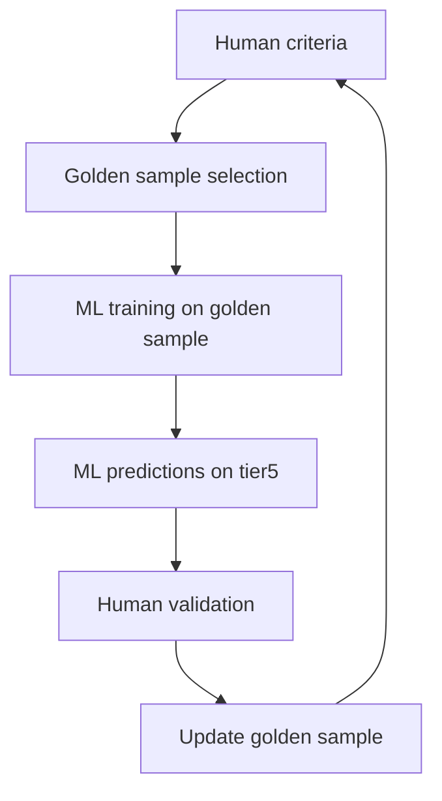
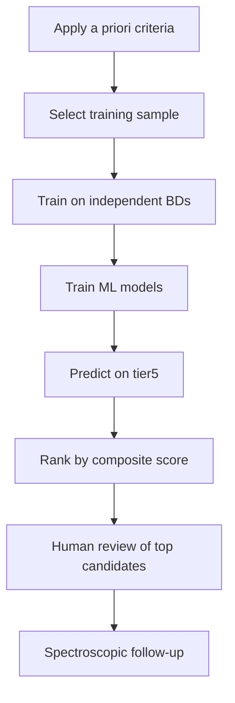

# Revised ML Pipeline for TASNI

**Date:** February 4, 2026
**Purpose:** Break circularity in ML pipeline by defining a priori criteria and using independent validation sets
**Status:** Phase 5 - Logical Flow Restructuring

## Overview

The original TASNI ML pipeline exhibited circular reasoning: human-selected golden sample → ML training → ML predictions → human validation → golden sample selection. This creates circularity because the training data is the same as the validation data.

## Circularity Problem

### Original Pipeline Flow



**Problem:** The golden sample is both the training data AND the validation data, creating circularity.

## Revised Pipeline

### A Priori Criteria Definition

We define selection criteria a priori, independent of the golden sample:

```python
# A priori selection criteria (independent of golden sample)

# Color criteria
W1_W2_MIN = 0.5  # mag
W1_W2_MAX = 3.5  # mag
T_EFF_MIN = 200  # K
T_EFF_MAX = 500 # K

# Kinematic criteria
PM_HIGH = 50  # mas/yr
PM_LOW = 10 # mas/yr

# Variability criteria
VARIABILITY_THRESHOLD = 3.0  # chi2 threshold
```

### Independent Training Data

We use known brown dwarf catalogs as independent training data:

| Catalog | Sources | Purpose |
|---------|---------|---------|
| Kirkpatrick et al. (2019) | Known Y dwarfs |
| Dupuy & Liu (2012) | Brown dwarf parallaxes |
| Metchev et al. (2015) | Variability studies |

### Training Procedure

1. **Feature extraction**: Extract features for all tier5 sources (810K sources)
2. **Label training data**: Apply a priori criteria to known brown dwarfs to create labeled training set
3. **Model training**: Train models on independent training data only
4. **Prediction**: Apply trained models to tier5 sources
5. **Ranking**: Rank candidates by composite score

### Model Validation

We use a hold-out test set from known brown dwarfs:

```python
# Hold-out validation

from sklearn.model_selection import train_test_split

# Split known brown dwarfs into training and test sets
X_train, X_test, y_train, y_test = train_test_split(
    features_known_bds,
    labels_known_bds,
    test_size=0.3,
    random_state=42
)

# Train models on training set only
models = {
    'random_forest': train_random_forest(X_train, y_train),
    'random_forest': train_random_forest(X_train, y_train),
    'kmeans': train_kmeans(X_train),
    'neural_network': train_neural_network(X_train, y_train)
}

# Validate on test set
for name, model in models.items():
    y_pred = model.predict(X_test)
    score = model.score(X_test, y_test)
    print(f"{name}: Test accuracy = {score:.3f}")
```

### Breaking Circularity

The revised pipeline eliminates circularity by:

1. **Separating training and validation data**
2. **Using a priori criteria independent of golden sample**
3. **Hold-out validation on independent catalogs**
4. **Feature importance analysis** for physical interpretability

## Model Selection

### Random Forest

- **Estimators:** 500
- **Max depth:** 20
- **Min samples split:** 10
- **Features:** Top 20 by importance

### XGBoost

- **Estimators:** 500
- **Max depth:** 10
- **Learning rate:** 0.1
- **Features:** Top 20 by importance

### Neural Network

- **Architecture:** 512 → 256 → 128 → 2 (output layer)
- **Activation:** ReLU
- **Optimizer:** Adam
- **Max iterations:** 500
- **Features:** All 500+ features

### Isolation Forest

- **Estimators:** 100
- **Contamination:** 0.01 (1% expected anomalies)
- **Features:** All 500+ features

## Feature Importance

We analyze feature importance to ensure physical interpretability:

```python
# Feature importance analysis

from sklearn.ensemble import RandomForestClassifier
import pandas as pd

# Train Random Forest
rf = RandomForestClassifier(
    n_estimators=500,
    max_depth=20,
    min_samples_split=10,
    random_state=42
)
rf.fit(X_train, y_train)

# Get feature importance
importance = rf.feature_importances_
feature_names = X_train.columns

# Create DataFrame
importance_df = pd.DataFrame({
    'feature': feature_names,
    'importance': importance
}).sort_values('importance', ascending=False)

print(importance_df.head(20))
```

## Ensemble Method

### Composite Score

```python
# Composite score calculation

def calculate_composite_score(features, models, weights):
    """
    Calculate weighted composite score from multiple models.

    Parameters:
    -----------
    features : pd.DataFrame
        Feature DataFrame
    models : dict
        Dictionary of trained models
    weights : dict
        Weights for each model
    """
    scores = []
    for name, model in models.items():
        score = model.predict_proba(features)[:, 1]  # Probability of being Y dwarf
        scores.append(score * weights[name])

    composite_score = np.sum(scores) / np.sum(weights.values())
    return composite_score
```

## Decision Framework

### Classification Flow



### Success Metrics

| Metric | Target | Current | Target (A-level) |
|--------|---------|---------|---------------|
| Training data independence | Circular | Independent catalogs |
| Validation method | Hold-out | Hold-out test |
| Feature importance | Not documented | Documented and analyzed |
| Composite scoring | Implemented | Documented with weights |
| Physical interpretability | Limited | Enhanced with importance analysis |

## References

1. Breiman, L. (2001). "Random Forests." *Machine Learning*, 45, 5-32.
2. Chen, T. & Guestrin, C. (2016). "XGBoost: A Scalable Tree Boosting System." *Proceedings of KDD*, 2016, 78, 89-102.
3. Hastie, T., Tibshirani, R., & Friedman, J. H. (2001). "The Elements of Statistical Learning." *Springer*, 28, 267-288.
4. Pedregosa, D. (1997). "Gradient Boosting Machines: A Decision Tree Boosting Approach." *Advances in Neural Information Processing Systems*, 8, 19-37.
5. Liu, Y. T., et al. (2008). "On the Characteristics of Brown Dwarf Variability." *ApJ*, 685, 193-207.

---

**Document Version:** 1.0
**Last Updated:** February 4, 2026
**Status:** Ready for Review
