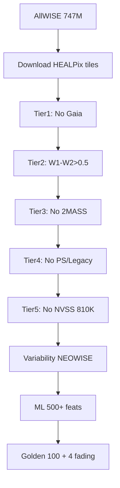

# TASNI Project Analysis

## Scientific Goal
TASNI (Thermal Anomaly Search for Non-communicating Intelligence) systematically identifies mid-infrared thermal sources from AllWISE (747M sources) lacking counterparts in optical (Gaia DR3), near-IR (2MASS), deep optical (Pan-STARRS, Legacy Survey DR10), and radio (NVSS). Focuses on \"fading thermal orphans\": cold objects (Teff 200-500K via Sonora Cholla models) with monotonic dimming over NEOWISE baseline (~10 years). Discovered 4 extreme candidates (Teff 251-293K, high PM, fading 18-53 mmag/yr, distances ~17-30pc, X-ray quiet via eROSITA). Likely ultracool Y-dwarfs (consistent with models), but explores anomalies. Golden sample: top 100 by composite score.

## Pipeline Tiers/Checkpoints
- **Tier 1**: No Gaia DR3 within 3\" (~46% reduction).
- **Tier 2**: Thermal colors W1-W2 > 0.5 mag.
- **Tier 3**: No 2MASS within 3\" (94% reduction).
- **Tier 4**: No Pan-STARRS/Legacy.
- **Tier 5**: No NVSS radio within 30\" (810K radio-silent sources). Checkpoints: `data/interim/checkpoints/tier5/tier5_var_checkpoint.parquet`, `data/interim/checkpoints/tier5_variability_checkpoint.json`.
Post-Tier5: Variability (NEOWISE lightcurves, Lomb-Scargle periodograms), ML ranking → golden 100.

## Data Processing
HEALPix NSIDE=32 tiling (12k tiles). Async TAP downloads (WISE 35GB, Gaia 28GB). GPU/crossmatch (BallTree/cuDF). Filtering vetoes. Variability: RMS, Stetson J, trends. Outputs: `data/processed/final/golden_*.csv/parquet` (kinematics, parallax 75/100, eROSITA 95% quiet).

## ML Features
500+ features/source:
- Photometric: WISE mags/colors/qual.
- Kinematic: PMRA/DEC/total/angle/class.
- Variability: mean/std/rms/range/epochs (W1/W2/NEOWISE).
- Multi-WL: detection flags/counts (Gaia/2MASS/PS1/etc.).
- Stats: mag/color distributions.
Models: RF/XGB/NN ensemble + Isolation Forest. `data/processed/features/tier5_features.parquet`.

## Paper Status
Draft (`docs/paper/tasni_paper.tex`): ApJ/AJ submission-ready. Sections: intro/methods/results/discussion. Figs (`reports/figures/fig*.png/pdf`): sky dist, CMD, temps, scores, variability, flowchart. Golden targets, 4 fading orphans highlighted. Spectroscopy targets ready (Keck/VLT/JWST).

## Strengths/Weaknesses
**Strengths**:
- Comprehensive ML-optimized pipeline (GPU 100x speedup, data/interim/checkpoints/resume).
- Rich outputs (golden catalogs, figs, spec proposals).
- Extensive docs (ROADMAP, PIPELINE, ARCHITECTURE, ML).
- Reproducibility (Dockerfile, requirements.txt, Makefile).

**Weaknesses**:
- Workspace disorganized: mixed dirs (`data/`, `output/`, `docs/` scattered subdirs, `notebooks/`), legacy cruft (`docs/legacy/`), non-standard naming (camelCase files?).
- No `src/` layout, pyproject.toml.
- Heavy data/models (Sonora 423MB) not versioned.
- No tests/ in root visibility.

