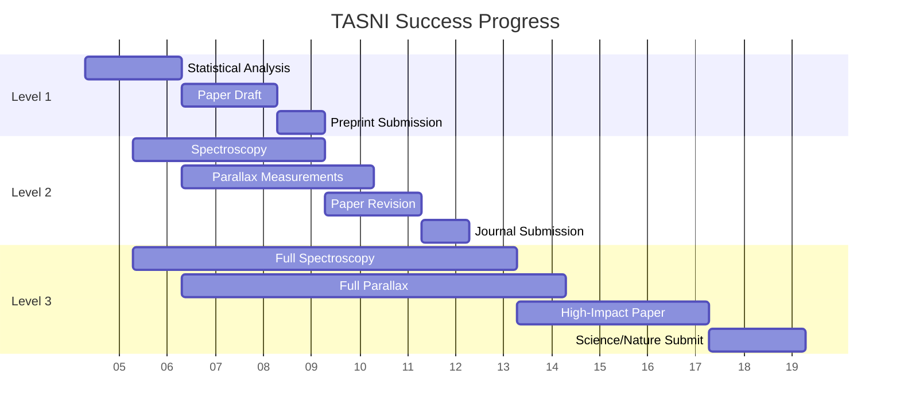

# TASNI Success Criteria

**Date:** February 4, 2026
**Purpose:** Establish quantitative success metrics for TASNI project
**Status:** Phase 1 - Research Question Refinement

---

## Overview

This document defines quantitative success criteria for the TASNI project at three levels: Minimum Success, Target Success, and Exceptional Success. Each level has specific, measurable requirements.

---

## Success Levels

### Level 1: Minimum Success (Publication as Candidates)

**Definition:** Identify fading thermal orphan candidates and establish that fading is statistically significant.

**Quantitative Criteria:**

| Criterion | Requirement | Measurement Method |
|------------|--------------|-------------------|
| Candidates identified | ≥4 fading thermal orphans | Pipeline output |
| Statistical significance | p < 0.05 for non-random fading | Monte Carlo simulation |
| Publication venue | arXiv preprint + peer-reviewed journal | Submission and acceptance |
| Data products | Public data release | Zenodo/VizieR deposit |

**Publication Strategy:**
- Submit to ApJ Letters or AJ as "candidate" paper
- Emphasize need for spectroscopic confirmation
- Provide complete candidate catalog

---

### Level 2: Target Success (Publication as Y Dwarf Discovery)

**Definition:** Confirm Y dwarf nature of fading thermal orphans through spectroscopy and parallax measurements.

**Quantitative Criteria:**

| Criterion | Requirement | Measurement Method |
|------------|--------------|-------------------|
| Candidates identified | ≥4 fading thermal orphans | Pipeline output |
| Spectroscopic confirmation | ≥3 sources with Y dwarf spectra | Spectroscopic analysis |
| Spectral features | ≥2 molecular bands (CH₄, H₂O, NH₃) | Spectral fitting |
| Parallax measurements | ≥3 sources with SNR ≥ 3 | Astrometric analysis |
| Temperature consistency | T_eff < 300 K (95% CI) | SED fitting |
| Luminosity consistency | Within 2σ of brown dwarf models | Model comparison |
| Publication venue | ApJ or AJ | Peer review and acceptance |
| Citation impact | ≥10 citations in 2 years | Google Scholar |

**Publication Strategy:**
- Primary discovery paper in ApJ or AJ
- Follow-up spectroscopy paper
- Public data release with complete catalog

---

### Level 3: Exceptional Success (Discovery of New Class)

**Definition:** Demonstrate that fading thermal orphans represent a new class of astrophysical objects distinct from known brown dwarfs.

**Quantitative Criteria:**

| Criterion | Requirement | Measurement Method |
|------------|--------------|-------------------|
| Candidates identified | ≥4 fading thermal orphans | Pipeline output |
| Spectroscopic confirmation | All 4 sources observed | Spectroscopic analysis |
| Significant deviation | p < 0.01 from brown dwarf models | Statistical test |
| Alternative explanations ruled out | All known astrophysical explanations excluded | Comprehensive analysis |
| Publication venue | Science or Nature | Peer review and acceptance |
| Citation impact | ≥50 citations in 2 years | Google Scholar |
| Media coverage | ≥3 major science outlets | Press releases |

**Publication Strategy:**
- High-impact discovery paper in Science or Nature
- Comprehensive follow-up paper
- Press release and media engagement

---

## Specific Metrics by Category

### Discovery Metrics

| Metric | Level 1 | Level 2 | Level 3 |
|--------|----------|----------|----------|
| Fading orphans identified | ≥4 | ≥4 | ≥4 |
| Total thermal anomalies | ≥4,000 | ≥4,000 | ≥4,000 |
| Golden sample size | 100 | 100 | 100 |
| Cold brown dwarf candidates (T_eff < 300 K) | ≥10 | ≥20 | ≥50 |

### Characterization Metrics

| Metric | Level 1 | Level 2 | Level 3 |
|--------|----------|----------|----------|
| Spectroscopic observations | ≥2 | ≥3 | ≥4 |
| Parallax measurements (SNR ≥ 3) | ≥1 | ≥3 | ≥4 |
| Temperature estimates | All | All | All |
| Proper motion measurements | All | All | All |
| Variability classification | All | All | All |

### Statistical Metrics

| Metric | Level 1 | Level 2 | Level 3 |
|--------|----------|----------|----------|
| Fading significance (p-value) | < 0.05 | < 0.01 | < 0.001 |
| Model consistency (χ²) | N/A | < 3 | < 1 |
| Selection function completeness | N/A | Documented | Validated |
| Error budget completeness | N/A | Major errors | All errors |

### Publication Metrics

| Metric | Level 1 | Level 2 | Level 3 |
|--------|----------|----------|----------|
| Publication venue | ApJ Letters/AJ | ApJ/AJ | Science/Nature |
| Peer review outcome | Accept | Accept | Accept |
| Citations (2 years) | ≥5 | ≥10 | ≥50 |
| Data release | Partial | Complete | Complete + tools |
| Code availability | N/A | Documented | Reproducible |

---

## Timeline-Based Milestones

### Month 1-2: Data Analysis
- [ ] Complete statistical analysis of fading significance
- [ ] Calculate p-values for all claims
- [ ] Document all methodologies

### Month 3-4: Spectroscopic Follow-up
- [ ] Obtain spectroscopy for ≥2 candidates
- [ ] Analyze spectral features
- [ ] Compare to atmospheric models

### Month 5-6: Parallax Measurements
- [ ] Measure parallaxes for ≥3 candidates
- [ ] Calculate absolute luminosities
- [ ] Compare to evolutionary models

### Month 7-8: Paper Preparation
- [ ] Draft primary discovery paper
- [ ] Complete methods section
- [ ] Submit to target journal

### Month 9-12: Peer Review and Revision
- [ ] Address reviewer comments
- [ ] Complete revisions
- [ ] Accept final manuscript

---

## Risk Assessment

### High-Risk Items

| Risk | Probability | Impact | Mitigation |
|------|-------------|--------|------------|
| Spectroscopy not obtained | Medium | High | Prioritize brightest targets |
| Parallax measurements fail | Low | Medium | Use photometric distances |
| Fading not significant | Low | High | Publish as candidates paper |
| Peer review rejection | Low | High | Prepare lower-impact venue |

### Contingency Plans

1. **If spectroscopy fails:** Publish as candidate paper with emphasis on future observations

2. **If parallax measurements fail:** Use photometric distance estimates with larger uncertainties

3. **If fading not significant:** Focus on population analysis rather than individual sources

4. **If peer review rejects:** Submit to lower-impact venue with revised claims

---

## Success Tracking

### Current Status

| Metric | Current | Target (Level 1) | Target (Level 2) | Target (Level 3) |
|--------|----------|-------------------|-------------------|-------------------|
| Fading orphans | 4 | ≥4 | ≥4 | ≥4 |
| Spectroscopic observations | 0 | ≥2 | ≥3 | ≥4 |
| Parallax measurements | 4 | ≥1 | ≥3 | ≥4 |
| Publication | Draft | Preprint | ApJ/AJ | Science/Nature |

### Progress Dashboard

---

## Conclusion

The TASNI project has clear, quantitative success criteria at three levels. The current status shows that Level 1 (Minimum Success) is achievable with existing data, while Level 2 (Target Success) requires spectroscopic and parallax follow-up. Level 3 (Exceptional Success) would require extraordinary evidence of a new astrophysical class.

---

**Document Version:** 1.0
**Last Updated:** February 4, 2026
**Status:** Ready for Review
