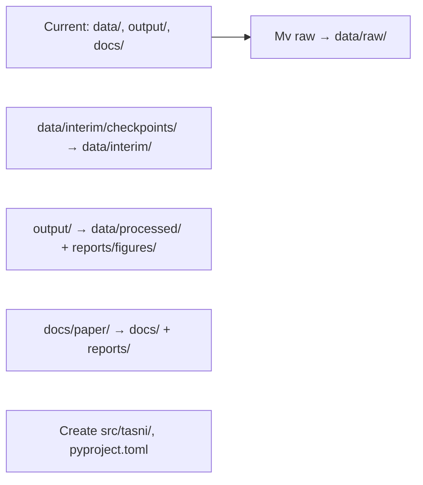

# TASNI Workspace Reorganization Plan

## Goals
- Standardize to Cookiecutter Data Science/Packaging structure for ML/Python projects.
- Lowercase_with_underscores naming.
- Separate concerns: src (code), data (raw/interim/processed/external), notebooks (exploration), reports/figures (outputs), docs (docs), tests (tests).
- Reproducibility: pyproject.toml (Poetry/PDM), src/ layout, Docker enhancements, .env.
- No execution: Plan only. Major moves/renames listed.

## Before Structure (Current)
```
tasni/
├── .env.example
├── .gitignore
├── .pre-commit-config.yaml
├── CONTRIBUTING.md
├── Dockerfile
├── Makefile
├── README.md
├── requirements-dev.txt
├── requirements.txt
├── .github/
├── benchmarks/
├── data/interim/checkpoints/
│   ├── tier1/
│   │   └── lamost_download.json
│   ├── tier2/ ... tier5/
├── data/
│   ├── catalogs/ (nvss.dat*)
│   ├── gaia_xmatch/
│   ├── legacy_survey/
│   ├── models/sonora_cholla/spectra_files/*.spec
│   ├── raw/
│   ├── release/ (draft.md, tasni_golden_targets.csv)
│   └── secondary/
├── docs/ (many .md: PIPELINE.md etc.)
│   ├── analysis/, api/, guides/, legacy/, output/, paper/ (tex, figs, sections/)
├── logs/
├── notebooks/
│   └── tasni_analysis.ipynb
└── output/
    ├── data/votes.db
    ├── features/tier5_features.parquet
    ├── figures/ (*.png/pdf, models/, synth.pdf/)
    └── final/ (*.csv/parquet: golden_*)
```

## Proposed After Structure
```
tasni/
├── pyproject.toml          # Dependencies, build config
├── README.md
├── .gitignore
├── .env.example
├── Dockerfile              # Enhanced multi-stage
├── Makefile
├── src/
│   └── tasni/              # Package: pipeline, ml, utils
│       ├── __init__.py
│       ├── pipeline.py
│       ├── ml/
│       └── ...
├── data/
│   ├── raw/                # Untouched: WISE/Gaia tiles, nvss.dat.gz
│   ├── external/           # Models: sonora_cholla/
│   ├── interim/            # Crossmatches, tier checkpoints
│   └── processed/          # Tier5, features, golden_*.parquet/csv
├── notebooks/              # tasni_analysis.ipynb
├── reports/
│   └── figures/            # All figs from reports/figures/, paper/figures/
├── docs/                   # Current docs/, paper/sections/*.md -> here
├── tests/                  # From benchmarks/? New pytest
├── data/interim/checkpoints/            # -> data/interim/
└── logs/                   # Keep
```

## Major Moves/Renames
1. `data/catalogs/nvss.dat*` → `data/raw/nvss.dat.gz`
2. `data/external/sonora_cholla/` → `data/external/sonora_cholla/`
3. `data/gaia_xmatch/`, `data/legacy_survey/` → `data/interim/`
4. `data/interim/checkpoints/` → `data/interim/data/interim/checkpoints/`
5. `data/processed/features/` → `data/processed/features/`
6. `data/processed/final/` → `data/processed/final/`
7. `reports/figures/` → `reports/figures/`
8. `docs/paper/figures/` → `reports/figures/paper/`
9. `docs/paper/sections/*.md` → `docs/sections/`
10. `benchmarks/` → `tests/benchmarks/`
11. Rename files: e.g., `tasni_analysis.ipynb` stays; src/tasni/ → src/tasni/
12. Create `pyproject.toml` (Poetry: deps from requirements.txt).
13. `.env`: DB paths, API keys.
14. Docker: Add pyproject, multi-stage (dev/prod).

## Migration Steps (For Later Mode)
- Backup current.
- Rsync/mv dirs.
- Update paths in config.py, notebooks, Makefile.
- `poetry init/add`.
- Lint/rename files (black, isort).


